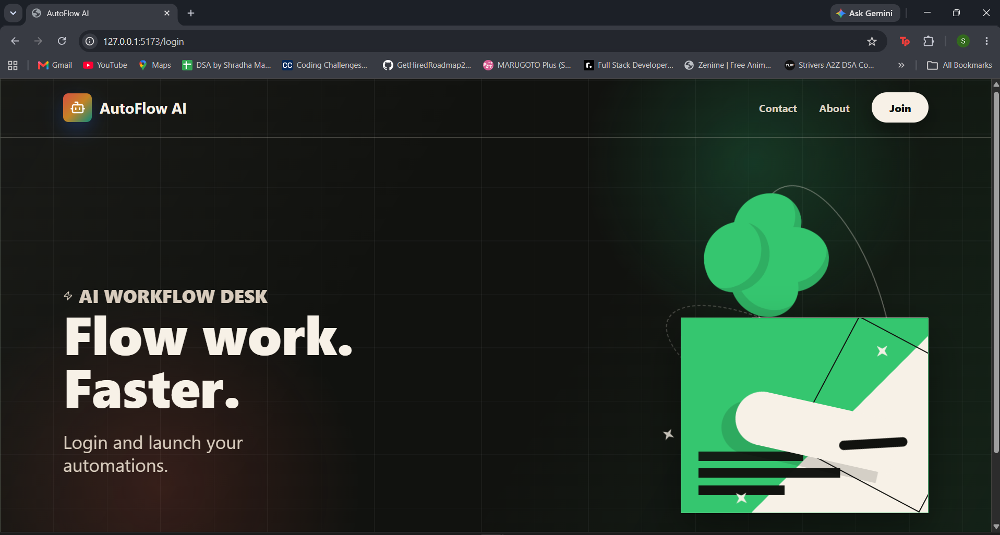
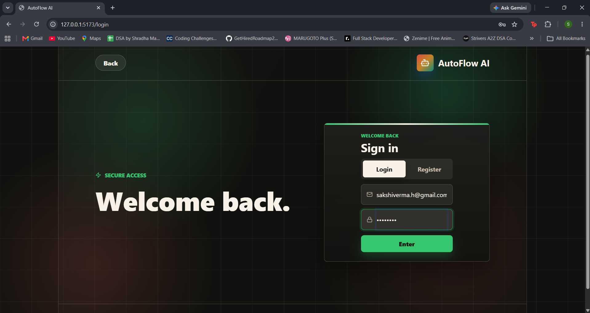
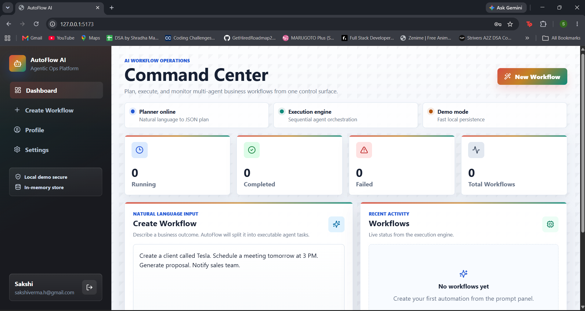
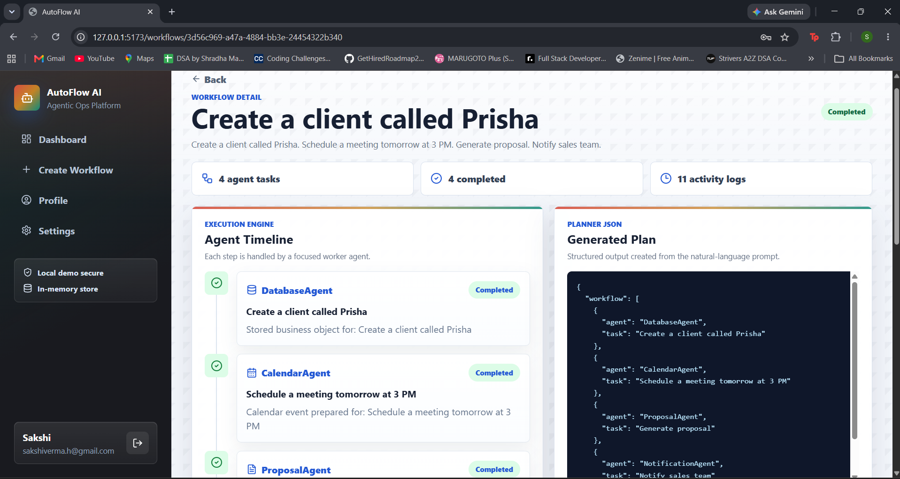

# AutoFlow AI

AutoFlow AI is a full-stack workflow automation demo that turns a natural-language request into a planned, executable business workflow. It includes authentication, a dark editorial landing page, a workflow dashboard, live task status updates, generated plan JSON, and activity logs.

## Preview

> Add your screenshots in `docs/screenshots/`, then update these image paths if needed.

### Landing Page



### Sign In Page



### Dashboard



### Workflow Detail



## Features

- Dark animated landing page with a separate sign-in screen.
- Demo authentication with JWT.
- React dashboard for creating and monitoring workflows.
- Express API with workflow and auth routes.
- Planner-style agent architecture.
- Sequential execution engine with live status updates.
- Activity logs and generated workflow plan output.

## Tech Stack

- React
- Vite
- React Router
- Node.js
- Express
- JWT
- bcryptjs
- lucide-react

## Project Structure

```text
autoflow-ai/
  backend/
    agents/
    controllers/
    database/
    middleware/
    routes/
    services/
    server.js
  frontend/
    src/
      components/
      pages/
      services/
      styles.css
  docs/
  package.json
  README.md
```

## Run Locally

Install dependencies:

```bash
npm install
```

Start frontend and backend together:

```bash
npm run dev
```

Open the app:

```text
http://127.0.0.1:5173/login
```

Backend health check:

```text
http://127.0.0.1:5050/api/health
```

## Demo Login

```text
Email: demo@autoflow.ai
Password: demo1234
```

## Environment Variables

Copy the backend example file:

```bash
copy backend\.env.example backend\.env
```

Then update:

```env
PORT=5050
JWT_SECRET=replace-with-a-long-secret
```

Never upload real `.env` files to GitHub.

## What Not To Upload

These are intentionally ignored by `.gitignore`:

- `node_modules/`
- `frontend/dist/`
- `.env` and `.env.*`
- log files
- local editor files
- local Codex/agent metadata

Keep `package-lock.json` because it helps other people install the same dependency versions.

## Add Screenshots

Create this folder:

```bash
mkdir docs\screenshots
```

Recommended screenshot names:

```text
docs/screenshots/landing-page.png
docs/screenshots/sign-in-page.png
docs/screenshots/dashboard.png
docs/screenshots/workflow-detail.png
```

After adding them, the images in the Preview section will show automatically on GitHub.

## Upload To GitHub Step By Step

### 1. Check ignored files

```bash
git status --short
```

Make sure you do not see:

```text
node_modules/
frontend/dist/
.env
```

If large files already appear as tracked files, remove them from Git tracking without deleting them locally:

```bash
git rm -r --cached node_modules frontend/node_modules frontend/dist
```

If you have a real env file tracked by mistake:

```bash
git rm --cached backend/.env
```

### 2. Stage the project

```bash
git add .
```

### 3. Commit

```bash
git commit -m "Prepare AutoFlow AI for GitHub"
```

### 4. Create a GitHub repository

Go to GitHub and create a new empty repository named:

```text
autoflow-ai
```

Do not initialize it with a README, `.gitignore`, or license because this project already has those files.

### 5. Connect your local repo

Replace `YOUR_USERNAME` with your GitHub username:

```bash
git branch -M main
git remote add origin https://github.com/YOUR_USERNAME/autoflow-ai.git
```

If `origin` already exists, use:

```bash
git remote set-url origin https://github.com/YOUR_USERNAME/autoflow-ai.git
```

### 6. Push

```bash
git push -u origin main
```

## If GitHub Rejects Large Files

First check what is taking space:

```bash
git status --short
```

Common fix:

```bash
git rm -r --cached node_modules frontend/node_modules frontend/dist
git add .gitignore
git commit -m "Remove generated files from tracking"
git push
```

If you already committed a file larger than GitHub allows, you may need to rewrite history with a cleanup tool such as `git filter-repo` or BFG Repo-Cleaner. For this project, the main thing is to avoid committing `node_modules` and `dist`.

## Demo Flow

1. Open the landing page.
2. Click `Join`.
3. Sign in with the demo account.
4. Create a workflow from a natural-language prompt.
5. Open the workflow detail page.
6. Show the generated plan, agent timeline, task statuses, and activity logs.

Example prompt:

```text
Schedule a meeting with the frontend team tomorrow at 5 PM, create a project in the database, and generate meeting notes.
```

## Future Improvements

- Replace the in-memory store with PostgreSQL.
- Add real Google Calendar and email integrations.
- Replace the rule-based planner with structured AI output.
- Add background jobs with BullMQ or Temporal.
- Add tests and GitHub Actions.
- Deploy frontend and backend separately.

